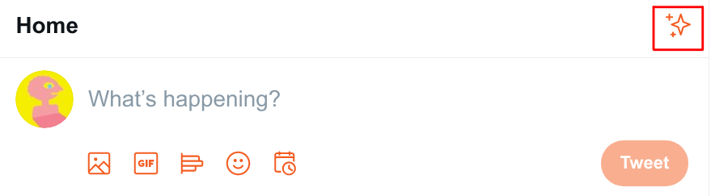
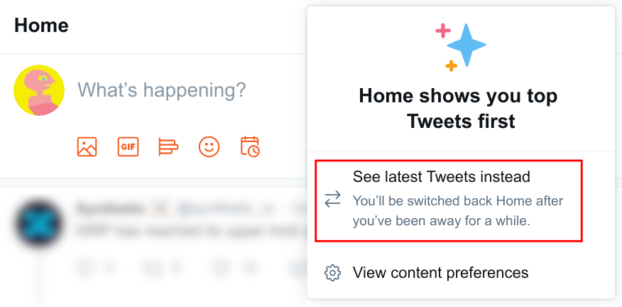
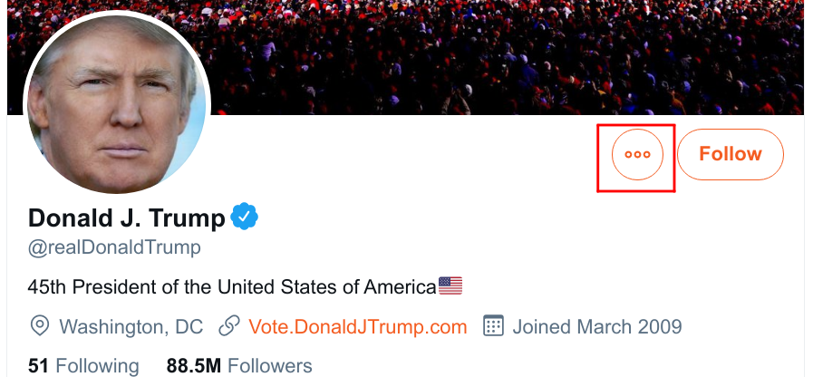
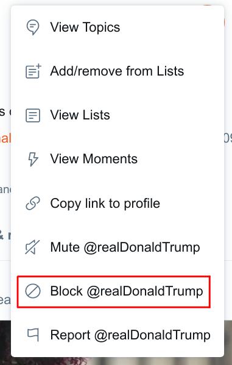
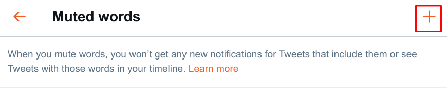
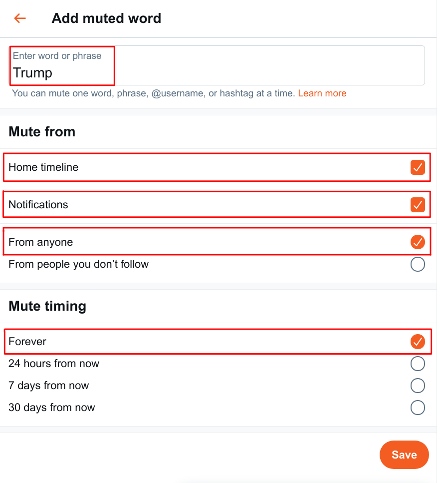

# Sane Defaults for Digital Wellbeing

If you want to preserve your individual sovereignty, you need to control the information you consume. Ad-blocking and abstinence from algorithmic feeds is a necessity in the digital age. Don't let them control your dopamine!

There is a concept in software engineering called a "sane default". It means a default setting that is chosen to ensure an optimal experience, which is to be reproduced across multiple machines. Unfortunately, the default settings you get when you create a new account on a digital platform today **don't** generally maximize your wellbeing, but rather **hook you in**.

Platforms use [dark patterns](https://en.wikipedia.org/wiki/Dark_pattern) to nudge you into unhealthy browsing habits. We will also note these down below.

We created a comprehensive list of sane defaults for every digital platform, to help you take back control.

Related: [7 Rules for Digital Hygiene](https://solmaz.io/thoughts/digital-hygiene-feeds/)

## Platforms

### Twitter

#### Change Twitter feed to "Latest Tweets" mode.

Click the "sparkles icon" at the top of your feed. (The icon is not descriptive and can be considered a dark pattern.)

Click "See latest Tweets instead".

Notice that it says "You'll be switched back Home after you've been away for a while". Make sure that you occasionally check the top of your feed so that it says "Latest Tweets" instead of "Home". This is a dark pattern. Twitter wants to make sure that people eventually converge to algorithmic feeds.

#### Block toxic accounts.

Navigate to the toxic account you want to block. Click the three-dots icon.

Click "Block @....".

Confirm that you want to block the account. From this point on, you will not be shown tweets or retweets from this account.

#### Mute toxic words.

Sometimes, it is not enough to just block accounts, as the toxic memes still creep into your feed. In that case, you may want to block certain keywords out of your feed. Twitter allows this functionality with "Muted keywords". When you mute a keyword, tweets including it will not show up in your feed.

Unfortunately, Twitter has hid the link to this feature. This is a dark pattern. You can reach the settings page by [clicking this link](https://twitter.com/settings/muted_keywords).

Then, click the plus icon.

In the next screen, simply enter the keyword that you want to mute. Don't forget to set the most strict settings. Twitter will by default select "From people you don't follow" instead of "From anyone".

Click Save to save your setting. You will never see that word again in your timeline.

### Facebook

TBD

### TikTok

**TikTok's only feature is its algorithmic feed. Therefore, sane usage is not possible. Simply delete the app from your phone.**

### Instagram

TBD

### Netflix

TBD

### Snapchat

TBD

## Contributing

If you want to contribute, you can fork the repository and create a pull request.
